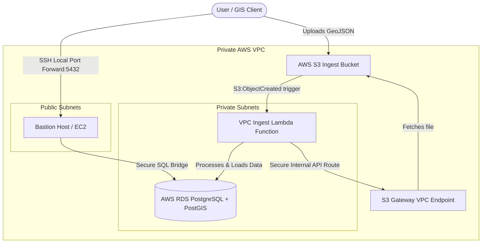

# ASTERRA DevOps Technical Assignment - Submission Overview

Thank you for the opportunity to work on this exciting technical assignment! This document serves as the requested **half-pager** detailing the architecture, design choices, successes, and the critical engineering hurdles that were resolved during the implementation.

---

## 1. Architectural System Design

Below is the end-to-end cloud infrastructure and event-driven data ingestion pipeline designed and deployed via Infrastructure as Code (Terraform):



---

## 2. What Worked (Key Successes)

1. **Robust Dual-Mode Application:** 
   The data-processing application ([app.py](file:///home/ofird/projects/Spatial-Ingest-Pipeline/src/backend/app.py)) was engineered to support dual runtimes:
   * **AWS Lambda Mode:** Runs serverless and reacts to S3 event notifications.
   * **Container Mode:** Starts an interactive Flask REST API on port `8080` (for local Docker/Kubernetes/Helm environments).
2. **Secure Database Operations:** 
   The RDS instance is entirely privately hosted. Database calls utilize strictly parameterized queries matching the native PostGIS spatial parser (`ST_GeomFromGeoJSON`) to completely protect against SQL Injection.
3. **Seamless Helm/K8s Configurations:** 
   Generalized all environment parameters so that DB hosts, users, and schemas are dynamically injected via Helm values rather than being hardcoded in deployments.

---

## 3. What Didn't Work (Engineering Challenges Overcome)

DevOps is about solving real-world constraints. Here are three critical engineering hurdles encountered and how they were systematically resolved:

### ❌ Hurdle A: Inaccessible Lambda Layers & Serverless Packaging
* **The Blocker:** Initially tried attaching a public `psycopg2` Lambda layer. However, IAM user restrictions blocked cross-account permissions (`lambda:GetLayerVersion`). Additionally, importing `flask` on startup caused Lambda to fail with `ModuleNotFoundError` since Flask isn't bundled.
* **The Resolution:** 
  1. Refactored the code to make Flask imports **completely optional and conditional** during startup.
  2. Wrote an automated Python utility to pull the pre-compiled `psycopg2-binary` Linux AMD64 wheels directly from PyPI and extract them into the `src/backend/` folder, allowing Terraform to bundle them self-contained into the `.zip` payload with zero third-party dependencies!

### ❌ Hurdle B: Lambda Timeouts inside Private Subnets
* **The Blocker:** Because the RDS PostgreSQL is in private subnets, the Lambda function had to be deployed inside the VPC. Once inside the private VPC subnets, the Lambda function lost all public internet access. Consequently, `boto3` requests to download the GeoJSON from S3 timed out indefinitely.
* **The Resolution:** Provisioned an **S3 Gateway VPC Endpoint** inside `vpc.tf` and associated it with the routing tables. This allows the Lambda to securely, internally, and instantaneously route traffic directly to S3 without needing a NAT Gateway!

### ❌ Hurdle C: Local Port Binding Conflicts
* **The Blocker:** Installing local PostgreSQL/PostGIS tools on Ubuntu started a background system service that bound to port `5432` on localhost, blocking the SSH tunnel from starting (`Address already in use`).
* **The Resolution:** Identified the system service owner and cleanly stopped the local daemon using `sudo service postgresql stop`, allowing the SSH tunnel to cleanly bridge to the AWS private database.

---

## 4. How to Verify / Reproduce

The entire setup has been verified and committed. You can reproduce the verification with these three steps:

1. **Trigger Ingestion:** Upload any `.geojson` file to your S3 bucket:
   ```bash
   aws s3 cp sample.geojson s3://<data-bucket-name>/sample.geojson
   ```
2. **Establish the Bridge:** Start the SSH tunnel to the bastion host in a separate terminal:
   ```bash
   ssh -o StrictHostKeyChecking=no -L 5432:<db-endpoint>:5432 -i <key.pem> ec2-user@<bastion-ip> -N
   ```
3. **Run SQL Check:** Connect and query the PostGIS geometries directly:
   ```bash
   psql -h localhost -p 5432 -U dbadmin -d postgres
   ```
   ```sql
   SELECT id, properties->>'city' AS city, ST_AsText(geom) AS geometry FROM geojson_features;
   ```
